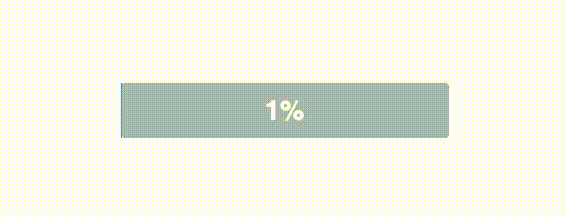

# Animated Progress Bar JS

- JS querySelector() to target Progress Bar for animation

- JS setInterval() to animate progress

- JS querySelector & scale() to animate size and color changes upon completion

